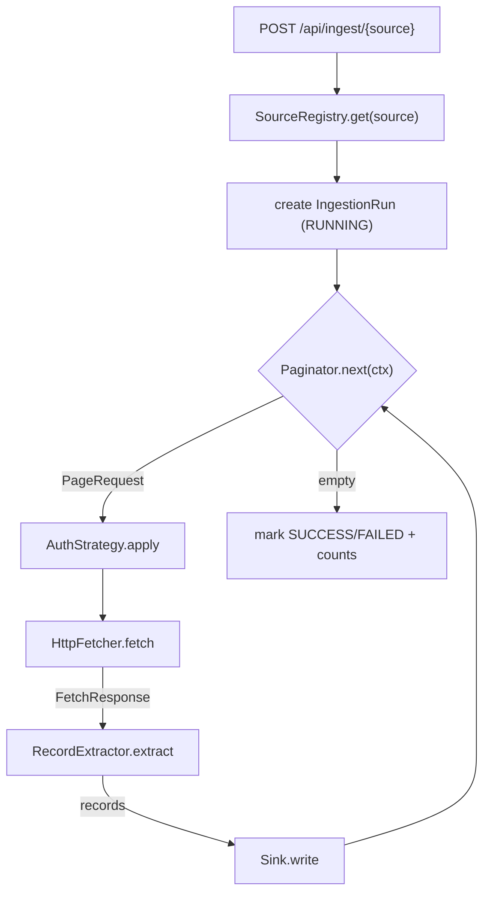

# Generic Data Ingestion Service

**TL;DR:** Config-driven ingestion — a new source is a YAML file; a new auth
scheme, pagination style, or destination is one class. Demonstrated live
against three structurally different public APIs (see
[Public APIs used](#public-apis-used)).

A configuration-driven service that ingests data from arbitrary HTTP APIs and
persists it to a pluggable destination. Adding a new **source** means adding a
YAML file. Adding a new **auth scheme, pagination style, or destination**
means adding one class — no existing code changes. See
[Architecture](#architecture--key-design-decisions) for what makes that true.

## Quickstart

```bash
docker compose up --build
```

That's the whole setup: Compose builds the app image, starts Postgres, waits
for its healthcheck, then starts the app only once Postgres is actually ready
(`depends_on: condition: service_healthy`) — not just "container started."

- API: `http://localhost:8080`
- Swagger UI: `http://localhost:8080/swagger-ui.html`
- Health: `curl http://localhost:8080/actuator/health`

Three demo sources load automatically from `sources/*.yaml`. Trigger one:

```bash
curl -X POST http://localhost:8080/api/ingest/pokeapi
curl http://localhost:8080/api/runs
```

### Environment variables

| Variable | Required | Purpose |
|---|---|---|
| `GITHUB_TOKEN` | Only for `sources/github.yaml` | Fine-grained, **read-only** GitHub personal access token (Metadata/Contents, read-only is enough). Create one at github.com/settings/personal-access-tokens. Without it, every other source still works fine — that one run just fails fast with a clear "environment variable not set" error instead of hanging or silently no-op'ing. |
| `DB_URL`, `DB_USER`, `DB_PASSWORD` | No | Override the Postgres connection; Compose already sets these for the bundled `db` service. |
| `INGESTION_SOURCES_DIR` | No | Where to load `*.yaml` source configs from (default `sources`). |

Secrets are **never** written in YAML — `auth.secret_env` names an
environment variable, and the value is resolved from the real environment at
run time. Nothing under version control ever contains a live credential;
`.gitignore` also excludes `.env*` defensively even though none is currently used.

## Public APIs used

Three real, public APIs, deliberately chosen to be structurally different on
both axes the config supports — proof the design is actually generic, not
just parameterized for one shape of API:

| Source | Auth | Pagination | Body shape | Sink |
|---|---|---|---|---|
| [PokeAPI](https://pokeapi.co) | none | `cursor` — follows a full next-page URL in `$.next` | enveloped: records at `$.results` | Postgres |
| [GitHub REST API](https://docs.github.com/rest) | `bearer` (`GITHUB_TOKEN`) | `link_header` — follows `rel="next"` in the RFC 5988 `Link` response header | top-level JSON array | Postgres |
| [Open Brewery DB](https://www.openbrewerydb.org) | none | `page_number` — increments `page`/`per_page` until a short page | top-level JSON array | Postgres |

Every row is a YAML file in `sources/`, not code. `sources/github.yaml`, for
instance, is the auth+pagination combination none of the other two exercise:

```yaml
auth:
  type: bearer
  secret_env: GITHUB_TOKEN
  scheme: Bearer
pagination:
  type: link_header
  max_pages: 3
```

## Architecture & key design decisions

**Config-as-source.** A `SourceConfig` fully describes one data source — base
URL, auth, pagination, where records live in the response, where they're
written — and the engine is the same generic loop for all of them:



Each box on the left of the loop (`Paginator`, `AuthStrategy`, `Sink`) is
resolved from the source's config **by string type**, via a registry that
injects `List<T>` and indexes it by `type()`:

```java
public AuthStrategyRegistry(List<AuthStrategy> strategies) {
    this.strategiesByType = strategies.stream()
            .collect(Collectors.toUnmodifiableMap(AuthStrategy::type, Function.identity()));
}
```

That's the whole trick. Spring discovers every `@Component` implementing
`AuthStrategy`/`Paginator`/`Sink` automatically; the registry just indexes
them. **A new strategy is a new `@Component` class — nothing else changes.**
This isn't just asserted in this README: `S3Sink`,
`LocalFileObjectStoreClient`, and `ObjectStoreClient` (the object-store sink,
see below) were added after everything else was built, and
`DefaultIngestionEngine`, `SinkRegistry`, and every existing `Sink`
implementation were untouched in the process — the change set was three new
files under `sink/`, one new test, and an `application.yml` property block
for the local-disk root/bucket. Nothing pluggable required editing.

**Package layout** mirrors this: `config` (the YAML → record loading),
`auth`/`pagination`/`extract` (three pluggable families with a deliberate
constraint — no cross-imports *between* them, verified by grep after
implementing them — so a change to how auth works can never ripple into how
pagination or extraction behave), `sink` (pluggable too, but legitimately
depends on `extract` for the `ExtractedRecord` type it writes), `http` (fetch
+ retry + rate limit), `engine` (orchestration), `run`/`persistence` (JPA),
`api` (REST + OpenAPI).

**Object-store sink proves the same property for destinations.** `S3Sink`
writes each page's records as JSON via an `ObjectStoreClient` seam;
`LocalFileObjectStoreClient` is a local-disk stand-in used for this demo.
Swapping to real S3 is purely a new `ObjectStoreClient` implementation
(`S3Client.putObject(...)` instead of `Files.write(...)`) — `S3Sink` itself
and the engine never change. Not wired into any demo source's `sink:` block
by default (they use `postgres`, since that's the durable story this
assignment is about), but `mvn test -Dtest=S3SinkTest` exercises it, and it's
one YAML line away from being live on any source.

## Design decisions, tradeoffs & assumptions

- **`ddl-auto: update`, not migrations.** Fine for an assignment iterating
  ticket-by-ticket; a real deployment would use Flyway/Liquibase for
  reviewable, rollback-able schema changes instead of Hibernate inferring DDL
  from entities at boot.
- **In-memory `SourceRegistry`, loaded once at startup.** Adding or editing a
  source YAML requires an app restart — there's no watch/reload and no
  "register a source" API. Simple, and correct for a config set that changes
  rarely; a multi-tenant version would need a real config store.
- **Pages within one run are fetched sequentially, not in parallel.** This is
  partly a simplicity choice, but for `cursor` and `link_header` pagination
  it's also a correctness requirement: page N+1's URL only exists once page
  N's response has been read, so those two strategies are inherently
  sequential. (`page_number` could theoretically be parallelized since page
  numbers are independent, but isn't — one strategy, one behavior, is
  easier to reason about.) Different *runs* do run concurrently, up to the
  bounded executor's size (`POST /api/ingest/{source}` returns 202
  immediately; the fetch loop runs on a background thread pool sized 2–4
  with a bounded queue, not caller-runs or unbounded).
- **`PostgresSink`/`S3Sink` ignore `SinkConfig.table`/`options`.** Both write
  to one shared destination (the `raw_records` table; one object-store
  bucket) partitioned by the `source` column / key prefix, not a
  per-source-configurable table or bucket. `WriteContext` — the frozen
  contract a `Sink.write` receives — only carries `(sourceName, runId,
  records)`, not the source's full `SinkConfig`, so per-source destination
  routing isn't wired through yet. `sink.table` in the demo YAMLs is
  accepted by config validation but not currently consulted.
- **Idempotent upsert, not append.** `RawRecordRepository.upsert` is a native
  `INSERT ... ON CONFLICT (source, record_key) DO UPDATE`, so re-running a
  source updates existing rows instead of duplicating — verified in
  `EngineIntegrationMatrixTest` end to end, not just at the SQL level.

## What I'd do with more time

- Wire `SinkConfig.table`/`options` through so Postgres/S3 destinations are
  genuinely per-source configurable, not one shared table/bucket.
- Flyway migrations instead of `ddl-auto`.
- A real `S3ObjectStoreClient` (AWS SDK v2) alongside the local-disk one,
  selected by profile/property — the seam is already there.
- Extraction failures are already isolated per-record (see
  `JsonPathRecordExtractor`), but a bad *write* fails the whole page's
  upsert batch — a dead-letter table for individually-failed records would
  be more resilient.
- Metrics (Micrometer counters/timers per source: pages fetched, records
  written, run duration, retry counts) — the pieces to hook into
  (`DefaultIngestionEngine`'s loop, `RestClientHttpFetcher`'s retry events)
  already exist; nothing's wired to a `MeterRegistry` yet.
- A "reload sources" endpoint or filesystem watch, instead of requiring a
  restart to pick up a new/edited YAML.
- Run the integration test matrix (WireMock + Testcontainers) in CI on every
  push — currently they're comprehensive but only run locally.

## Deploying

`docker compose up --build` is the whole local story. For a hosted demo, the
path I'd take (not currently deployed, since it needs real hosting
credentials this environment doesn't have) is **Render**, using its
Docker-based Web Service pointed at this repo's `Dockerfile`, plus a Render
managed Postgres instance:

1. New Postgres instance on Render; it gives you a connection string.
2. New Web Service → "Docker" → this repo. Set `DB_URL`/`DB_USER`/`DB_PASSWORD`
   from the Postgres instance's credentials, and `GITHUB_TOKEN` if the GitHub
   source should run there — all as Render's encrypted environment variables,
   never in the repo.
3. Render's health check path → `/actuator/health` (already exposed, already
   what Compose's own healthcheck uses locally).

Railway and Fly.io both work the same way (Dockerfile-based service + env
vars + a Postgres add-on); Render's just the one with the least YAML of its
own. In every case: **secrets are environment variables set in the host's
dashboard, never committed** — this repo has nothing in it that even looks
like a credential (checked via `git grep` for token-shaped strings before
writing this), and `.gitignore` excludes `.env*` defensively.

## Use of AI tools

Built with Claude Code, working through the design ticket by ticket, with the
assignment's own conventions (`CLAUDE.md`) as the spec for each one.

**Where it got something wrong, and how I caught it:** implementing the
stretch object-store sink (`S3Sink`), the first version keyed every write as
`{source}/run-{runId}.json` — one object per run. That's wrong: the engine
calls `Sink.write` once **per page**, not once per run (every other sink,
`PostgresSink` and `StdoutSink`, is naturally fine with that because an
upsert or a log line is additive — writing a file is not). With a fixed
per-run key, each page's write silently overwrote the previous page's
object. Unit tests alone didn't catch it, because the test only wrote once.
It surfaced by actually running the built app against a live source
(`breweries`, 5 pages) with the sink pointed at the object store and
checking the output: **250 records fetched, only 50 landed on disk.** Fixed
by keying each page's object uniquely (`{source}/run-{runId}/{uuid}.json`)
under a shared prefix, so a run's full data is the union of every object
under that prefix — which is also just how S3-based data lakes are
conventionally structured, so the fix is more correct than the original
design, not just a patch. Re-verified live (250/250 recovered) and pinned
with a regression test that calls `write()` twice for the same run and
asserts both pages' objects survive.

A few smaller, same-shaped issues came up earlier and are worth a one-line
mention rather than full writeups: three separate dependency-version
mismatches (WireMock 3.13.2 needing a newer `httpclient5` than Spring Boot's
BOM pins; Testcontainers 1.19.7 negotiating too old a Docker API version for
current Docker Desktop; `springdoc-openapi` 2.7.0+ requiring Spring Framework
6.2, one minor ahead of what Boot 3.2.5 ships), all caught the same way —
running the thing, not just compiling it — and fixed by pinning to a
compatible version. And one real API-design bug: `RestClientHttpFetcher`
gained a second constructor (for fast-backoff tests) without `@Autowired` on
the intended one, which every test happily ignored (they all construct it
directly with `new`) until the first real `@SpringBootTest` needed Spring to
autowire it and failed with an ambiguous-constructor error.

The pattern across all of these: nothing here was caught by writing code
that *looked* right or by unit tests in isolation — every one surfaced by
actually executing the full path (`mvn test` against real Postgres/WireMock,
or the built Docker image against a real API) and reading what actually
happened.

